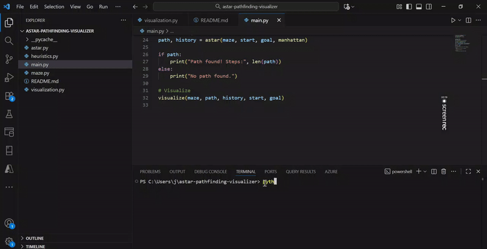

# 🗺️ MazeSolver - A* Pathfinding Visualizer

An interactive visualization tool for the A* (A-Star) pathfinding algorithm built with Python. Watch how the algorithm finds the shortest path through a randomly generated maze in real-time!

  

## ✨ Features

- **Random Maze Generation** - Each run creates a unique maze with adjustable wall density
- **Real-time Visualization** - Watch open/closed nodes expand in real-time
- **Multiple Heuristics** - Manhattan & Euclidean distance calculations
- **Interactive Controls** - "Play Again" button to replay the animation
- **Color-coded Grid** - Clear visual distinction for different cell types
- **Path Reconstruction** - Highlights the final shortest path in yellow

## 🎨 Color Scheme

| Color  | Meaning |
|--------|---------|
| ⬜ White | Empty Cell |
| ⬛ Black | Wall/Obstacle |
| 🟩 Green | Start Position |
| 🟥 Red | Goal Position |
| 🟨 Yellow | Final Path |
| 🟦 Blue | Closed Node (Explored) |
| 🟪 Cyan | Open Node (Frontier) |

## 🚀 Quick Start

### Prerequisites
- Python 3.6 or higher
- pip (Python package installer)

### Installation

1. **Clone the repository**
```bash
git clone https://github.com/Laibakhalid23/astar-pathfinding-visualizer.git
cd astar-pathfinding-visualizer
```
2. **Install required packages**
```bash
pip install numpy matplotlib
```
3. **Run the visualizer**
```bash
python main.py
```
## 🧠 How It Works
### The Algorithm
A* finds the shortest path using:
```text
f(n) = g(n) + h(n)
```
- g(n) = Steps taken from start

- h(n) = Estimated steps to goal

- f(n) = Total path estimate

### Two Heuristics You Can Use:
```python
def manhattan(a, b):
    return abs(a[0]-b[0]) + abs(a[1]-b[1])

def euclidean(a, b):
    return ((a[0]-b[0])**2 + (a[1]-b[1])**2)**0.5
```

## 🎮 Usage Guide
### 🎲 Create Custom Mazes
In main.py, tweak these parameters:

```python
rows = 20        
cols = 30        
wall_density = 0.25  
```
### ⚡ Adjust Animation Speed
In visualization.py:

```python
plt.pause(0.05)
```
### 🔄 Switch Heuristics
```python
path, history = astar(maze, start, goal, manhattan)
```

## 📁 Project Structure
astar-pathfinding-visualizer/
│
├── 📄 main.py              # 🎬 Program starter
├── 📄 maze.py              # 🏗️ Maze generator
├── 📄 astar.py             # 🧮 Algorithm core
├── 📄 heuristics.py        # 📏 Distance calculators
├── 📄 visualization.py     # 🎨 Animation engine
├── maze_finder.mp4         # 🎬 A demo video 
└── 📄 README.md           
